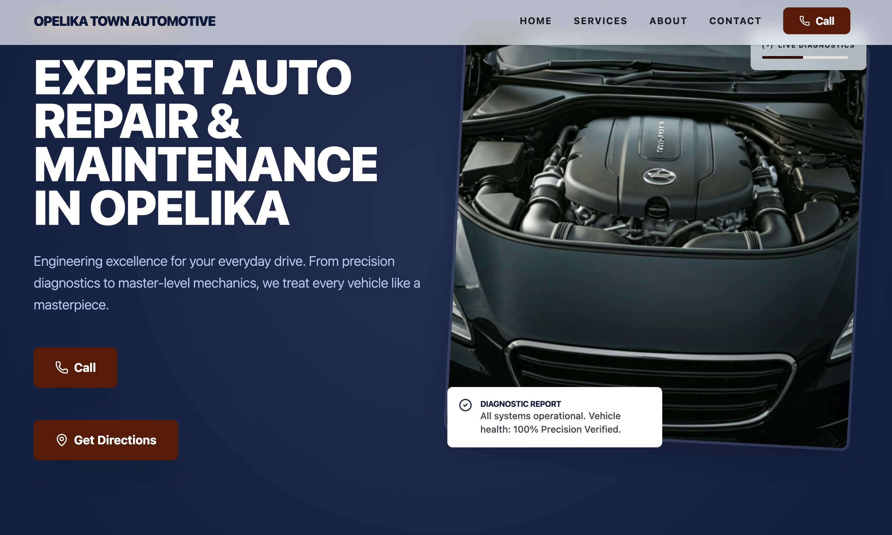

<div align="center">

# Opelika Town Automotive

### A conversion-focused website for a local automotive repair business

[Live Website](https://opelikatown.formawebsite.com) · [Developer Portfolio](https://formawebsite.com) · [GitHub Profile](https://github.com/almendron02)


</div>



## Overview

Opelika Town Automotive is a responsive single-page website designed to give a local repair shop a clear, credible, and conversion-oriented digital presence. The experience helps visitors quickly understand the shop's services, operating hours, location, and contact options without navigating through unnecessary screens.

The project combines a strong automotive visual identity with practical business goals: make the phone number easy to reach, communicate technical expertise, and present service information clearly across desktop and mobile devices.

## Project Goals

- Establish a professional online presence for a local automotive business.
- Make core services, hours, address, and phone details easy to find.
- Turn website visits into calls and appointment inquiries.
- Deliver a polished experience across mobile, tablet, and desktop layouts.
- Build the interface with reusable, typed React components and a consistent design system.

## Highlights

- **Responsive navigation:** Desktop navigation transitions into a focused mobile menu for smaller screens.
- **Conversion-focused calls to action:** Prominent click-to-call links keep the primary customer action accessible throughout the experience.
- **Structured service catalog:** Automotive services are organized by diagnostics, mechanical repair, maintenance, and climate systems.
- **Interactive service visualization:** An animated repair-progress component demonstrates how service status can be communicated clearly.
- **Scroll-aware interface:** The navigation adapts as visitors move through the page while preserving access to key actions.
- **Custom visual system:** Tailwind theme tokens define the typography, colors, surfaces, spacing, and utility styles used across the site.
- **Purposeful motion:** Motion animations support content hierarchy and interaction feedback without distracting from the business information.

## Built With

| Area | Technology | Purpose |
| --- | --- | --- |
| Interface | React 19 | Component-based user interface |
| Language | TypeScript | Typed application code and component props |
| Build tooling | Vite 6 | Local development and optimized production builds |
| Styling | Tailwind CSS 4 | Responsive layouts and custom design tokens |
| Animation | Motion | Entrance animations and interactive feedback |
| Icons | Lucide React | Consistent interface iconography |
| Deployment | Netlify | Public hosting and continuous delivery |

## Engineering Approach

The application is intentionally lightweight. Service information is modeled as structured data and rendered through reusable UI patterns, while shared visual rules live in the Tailwind theme. Local state controls the mobile navigation and scroll-aware header, and Motion provides declarative animation behavior.

The result is a maintainable frontend that can be expanded with appointment scheduling, a content management system, customer reviews, or a service-status backend without requiring a redesign of the core experience.

## Project Structure

```text
.
├── docs/
│   └── opelika-town-automotive-preview.jpg
├── src/
│   ├── App.tsx          # Page sections, UI state, and service data
│   ├── index.css        # Tailwind theme and global styles
│   └── main.tsx         # React application entry point
├── index.html           # Document metadata and application mount point
├── package.json         # Scripts and dependencies
├── tsconfig.json        # TypeScript configuration
└── vite.config.ts       # Vite and Tailwind configuration
```

## Run Locally

### Prerequisites

- Node.js 18 or newer
- npm

### Installation

```bash
git clone https://github.com/almendron02/Opelika-Town-Automotive.git
cd Opelika-Town-Automotive
npm install
npm run dev
```

Open [http://localhost:3000](http://localhost:3000) in your browser.

No API key is required to run the current frontend experience.

## Available Scripts

| Command | Description |
| --- | --- |
| `npm run dev` | Start the Vite development server on port 3000 |
| `npm run build` | Create an optimized production build |
| `npm run preview` | Preview the production build locally |
| `npm run lint` | Run TypeScript checks without emitting files |
| `npm run clean` | Remove the generated `dist` directory |

## What This Project Demonstrates

- Translating a real small-business use case into a focused product experience.
- Balancing brand expression with usability and conversion goals.
- Building responsive layouts with modern React and Tailwind CSS.
- Using TypeScript and reusable components to keep interface code maintainable.
- Applying animation as functional interaction feedback rather than decoration.

## Author

Designed and developed by [Angel Gonzalez](https://github.com/almendron02) as part of the [Forma](https://formawebsite.com) web design and development portfolio.
